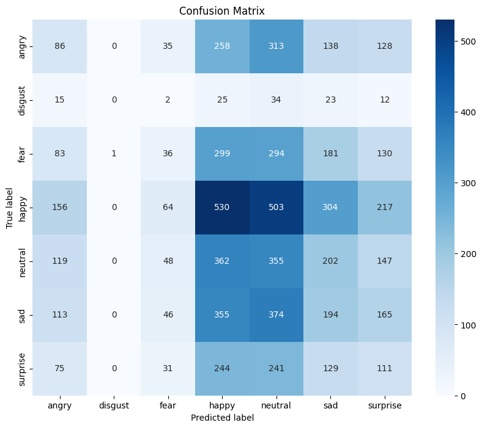

# Emotion Detection using Transfer Learning (VGG16 & ResNet50)

## 📌 Overview

This project detects human emotions from facial expressions using transfer learning with pre-trained deep learning models.

## 🧠 Models Used

* VGG16 (Transfer Learning)
* ResNet50 (Transfer Learning)

## ⚙️ Approach

* Used ImageNet pre-trained weights
* Fine-tuned top layers
* Compared performance of both models

## 📊 Results

* VGG16 Accuracy: XX%
* ResNet50 Accuracy: XX%

## 🛠️ Tech Stack

* Python
* TensorFlow / Keras
* OpenCV
* NumPy, Matplotlib, Seaborn

## 🚀 How to Run

```bash
pip install -r requirements.txt
```

Run notebook:

```bash
emotion_detection.ipynb
```

## 📁 Project Structure

```
emotion-detection-dl/
│── emotion_detection.ipynb
│── images/
│── README.md
```

## 📊 Results

### Confusion Matrix


### Performance Metrics

